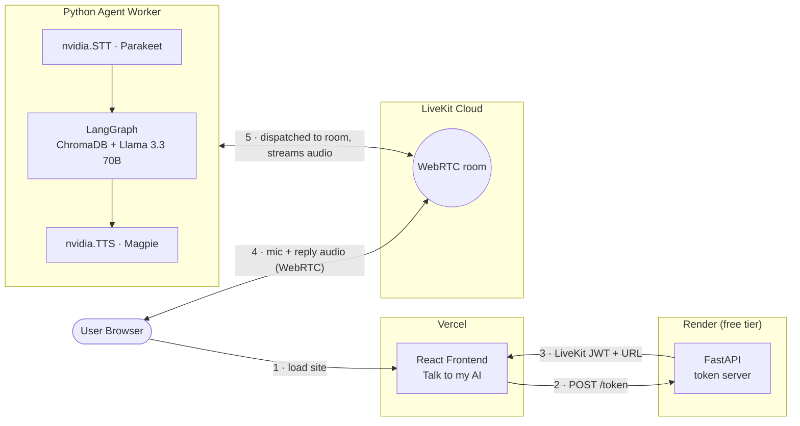

# 🎙️ Voice Agent — NVIDIA NIM · LangGraph · WebRTC

### 🔗 [Live Demo](https://voice-ai-assistant-nu.vercel.app) — click **Talk to my AI** and allow your microphone

> ⏱️ **Live voice demo available on request.** The site is always up, but voice
> replies run through an agent worker I host on-demand — [reach out](https://github.com/mithun2244)
> for a live walkthrough and I'll spin it up.

[](https://github.com/mithun2244/Voice-AI-Assistant/actions/workflows/reasoning-test.yml)

A real-time, browser-based voice agent that lets hiring managers **talk to your AI**
about your resume and GitHub projects. Speech in, speech out — no phone network.

## Architecture



*Flow: the browser loads the Vercel frontend, which asks the Render FastAPI
server for a LiveKit token; the browser then streams mic audio to a LiveKit
Cloud room over WebRTC, where the Python agent worker (Parakeet STT → LangGraph
reasoning → Magpie TTS) joins, answers, and streams speech back.*

## Sample conversation transcript

A hiring manager speaking to the live agent. Every answer is grounded in the
owner's resume/GitHub data, and the final turn triggers the **human-in-the-loop
hand-off** — a real Discord ping to the author with a link back to the app.

> 🧑 **Hiring manager:** Hi! What kind of projects have you built?
>
> 🤖 **Agent:** Happy to share! A couple I'm proud of: the *Agentic FAQ Support
> Pipeline* — an automated support system where reasoning agents route and
> answer user queries with no human in the loop — and *Insight RAG*, a
> retrieval-augmented system that pulls deep insights from document knowledge
> bases. Both are up on my GitHub.
>
> 🧑 **Hiring manager:** Nice. What's the stack behind Insight RAG?
>
> 🤖 **Agent:** Python end to end, built on RAG frameworks with a vector
> database for retrieval. The fun part was the document-chunking strategy —
> keeping the retrieved context tight so answers stay accurate.
>
> 🧑 **Hiring manager:** Great. And what salary are you looking for?
>
> 🤖 **Agent:** I don't have that detail on hand — that's really one for the
> person themselves. Would you like me to connect you with them directly?
>
> 🧑 **Hiring manager:** Yes, please.
>
> 🤖 **Agent:** Done — I've pinged them and shared this link, so they can jump
> in and talk with you directly. 🔔

## Layout

```
Voice_agent/
├── requirements.txt          # Python deps
├── backend/
│   ├── agent.py              # LangGraph graph: transcribe → retrieve → reason → synthesize
│   ├── agent_worker.py       # LiveKit worker: Parakeet STT → graph → TTS (real audio loop)
│   ├── rag.py                # Local ChromaDB store for resume + project data
│   ├── server.py            # FastAPI: LiveKit token minting + text fallback
│   ├── scripts/
│   │   └── smoke_call.py    # headless end-to-end voice test (no browser)
│   └── knowledge/           # resume.md / projects.md templates — edit + re-seed
└── frontend/                # Vite + React + LiveKit client
    ├── src/App.jsx          # "Talk to my AI" mic UI
    └── ...
```

## Backend setup

```bash
python -m venv .venv
.venv\Scripts\activate            # Windows (use `source .venv/bin/activate` on macOS/Linux)
pip install -r requirements.txt
```

Create a `.env` at the **repo root** (all backend scripts load it regardless of
launch directory):

```bash
NVIDIA_API_KEY=nvapi-...            # from https://build.nvidia.com
LIVEKIT_URL=ws://localhost:7880     # defaults match `livekit-server --dev`
LIVEKIT_API_KEY=devkey
LIVEKIT_API_SECRET=secret
```

Then:

```bash
# 1. Seed the knowledge base (after adding files to backend/knowledge/)
python backend/rag.py

# 2. Smoke-test the reasoning graph (text only)
python backend/agent.py "What are your strongest projects?"

# 3. Run the API server
cd backend
uvicorn server:app --reload --port 8000
```

For the live audio path, also run a LiveKit server locally:

```bash
livekit-server --dev        # serves ws://localhost:7880 with devkey/secret
```

## Frontend setup

```bash
cd frontend
npm install
copy .env.example .env      # optional; defaults to http://localhost:8000
npm run dev                 # http://localhost:5173
```

Open the app, click **Talk to my AI**, allow the microphone, and start talking.

## What's a placeholder vs. wired

| Piece | Status |
|-------|--------|
| LangGraph orchestration | ✅ wired |
| ChatNVIDIA (Llama 3.3 70B) reasoning | ✅ wired |
| ChromaDB retrieval | ✅ wired |
| LiveKit token minting + React WebRTC client | ✅ wired |
| **Parakeet Realtime ASR + EOU** | ✅ wired in `agent_worker.py` (`nvidia.STT`) |
| **Magpie TTS synthesis** | ✅ wired in `agent_worker.py` (`nvidia.TTS`) |

The audio loop lives in **`backend/agent_worker.py`** — a LiveKit agent worker
that joins the room, subscribes to the caller's mic, and runs the full
`AgentSession` pipeline:

- **STT** — `nvidia.STT()` (Parakeet streaming ASR + endpointing)
- **LLM** — `LLMAdapter(graph=voice_agent)`, our ChromaDB + Llama 3.3 70B graph
- **TTS** — `nvidia.TTS()` (Magpie voice)
- **VAD** — `silero.VAD.load()` for turn detection

The worker extras are in `requirements.txt`, so `pip install -r requirements.txt`
already covers them. Run the worker alongside the API server (needs
`NVIDIA_API_KEY` and a reachable LiveKit server):

```bash
python backend/agent_worker.py dev      # dev mode, hot-reload
```

On this path the session plugins own ASR/TTS, so the graph's own
`transcribe_node` / `synthesize_node` are no-ops and only `retrieve` + `reason`
do work.

## Knowledge base

`backend/knowledge/` ships with `resume.md` and `projects.md` **templates** —
fill in the bracketed placeholders with your real details, then embed them:

```bash
python backend/rag.py
```

## Testing

**1. Reasoning only (text, no audio).** Fastest check that retrieval + the LLM
work. Needs `NVIDIA_API_KEY` and a seeded ChromaDB:

```bash
python backend/agent.py "What are your strongest projects?"
```

**2. Full voice loop, headless (no browser).** `backend/scripts/smoke_call.py`
acts as a synthetic caller: it joins the LiveKit room like the frontend would,
speaks a question (synthesized with NVIDIA TTS), and listens for the agent's
spoken reply — exercising the entire path:

```
caller mic → Parakeet STT → LangGraph (ChromaDB + Llama) → Magpie TTS → caller
```

Prerequisites — all three must be running first:

```bash
livekit-server --dev                    # terminal 1
python backend/agent_worker.py dev      # terminal 2
```

Then run the smoke test (terminal 3):

```bash
python backend/scripts/smoke_call.py
python backend/scripts/smoke_call.py "What is your strongest project?"   # custom question
```

It prints each stage and ends with `RESULT: [PASS]` (exit code `0`) once the
agent joins and speaks a reply, or `[FAIL]` (non-zero) otherwise — so it can
gate CI. Watch the **worker console** at the same time for the per-stage logs:

```
track subscribed … browser mic audio is routing
USER transcribed (final=True): 'What is your strongest project?'
retrieved 4 context chunk(s) from ChromaDB
agent state: thinking -> speaking
```

If the agent goes silent, those logs pinpoint the stage that stopped. A
`DEGRADED` / `cannot be invoked` line means the NVIDIA hosted function is
temporarily down — retry shortly, or point `NVIDIA_TTS_FUNCTION_ID` /
`NVIDIA_STT_FUNCTION_ID` in `.env` at another ACTIVE function.

**3. Offline test suite (no network, no keys).** `backend/tests/` mocks the
NVIDIA LLM/embeddings and the Discord webhook, so it runs anywhere in ~1s. It
covers the reasoning graph and the hand-off guards (consent + idempotency):

```bash
pytest backend/tests -q
```

This is what CI runs on every push (see below).

## Continuous integration

Two GitHub Actions workflows, deliberately split so a slow NVIDIA endpoint can
never block your commits:

| Workflow | File | Trigger | Gates pushes? | What it does |
|----------|------|---------|---------------|--------------|
| **Reasoning test** | `reasoning-test.yml` | every push / PR | ✅ yes | Runs the offline `pytest` suite — deterministic, no secrets, no network. This is the badge at the top of the README. |
| **Live reasoning (nightly)** | `live-reasoning.yml` | daily 06:00 UTC + manual | ❌ no | Exercises the **real** NVIDIA path (seed ChromaDB → reason with Llama 3.3) so you get a genuine integration signal. Needs the `NVIDIA_API_KEY` repo secret. |

Because the nightly job hits the live endpoint, it goes red whenever NVIDIA is
slow or unreachable — that's expected and, being non-gating, it never affects
the green push badge. Run it on demand any time:

```bash
gh workflow run live-reasoning.yml
# or: Actions tab → "Live reasoning (nightly)" → "Run workflow"
```

To enable the nightly run, add your key under **Settings → Secrets and
variables → Actions** as `NVIDIA_API_KEY`.
